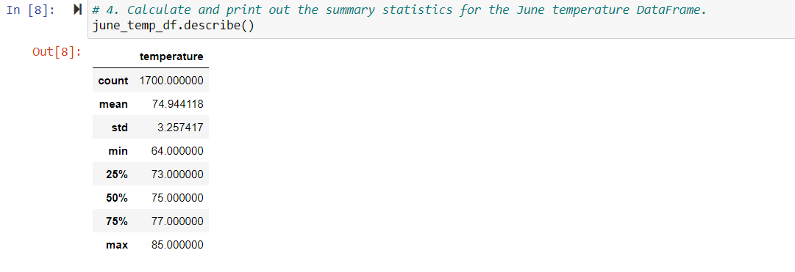
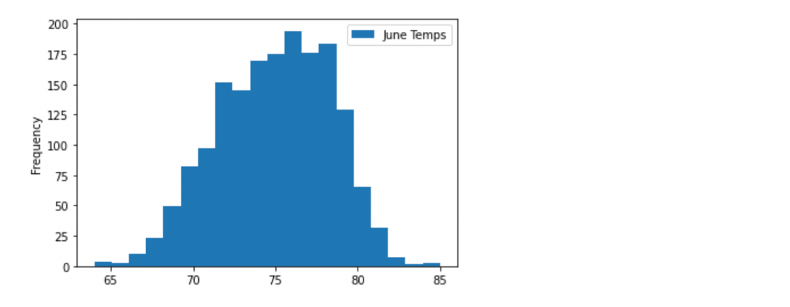
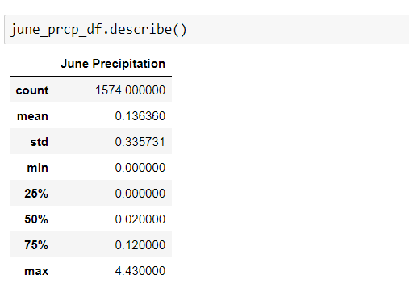
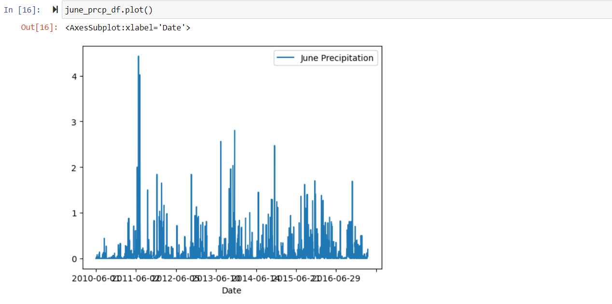
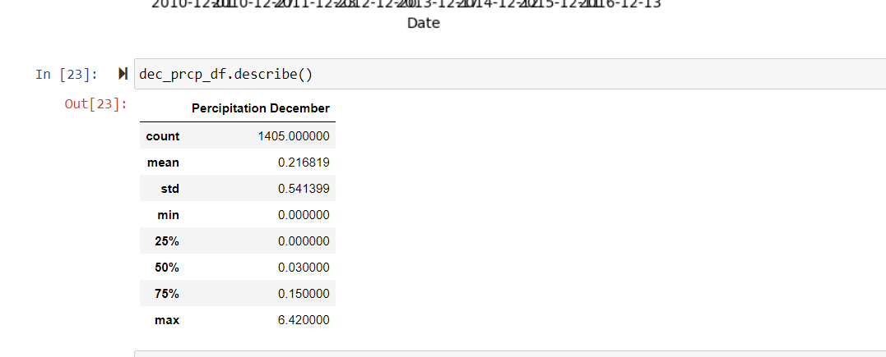
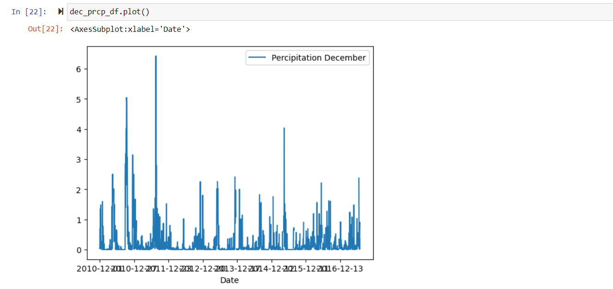

# surfs_up
Advanced Data Storage and Retrieval
## Overview of the analysis
Before investing in Surfing and shake shop in Hawaii, Investor W.AVy wants to confirm the weather, Hence he wants a project showing analysis of weather data in Oahu from june to December to see if he will be profitable in surfs and ice cream shop business throughout the year. 
Tools used in this project is : Python, Jupyter, pandas, Flask and VS code, dependancies imported through SQLALchemy, numpy, panda and datetime, dataset: hawaii.sqlite

## Results
When extracted the data from weather stations, we found out that june temperature is 74.94F with a range of min to 64F and max upto 85F. 

On the other side, when we extracted the weather data for December to see if from june to december Mr. W.Avy will be profitable in his business or not, average december temperature is 71.04F with maximum to 83F and minimum to 56F.
Here are three major analysis from the project:
- Average temperature throughout the whole year is 72.5F.
- In Oahu island, temperature for june and december is same.
- As standard deviation for both months is same, there is no much fluctuations in temperature for complete year. 

## Summary
From above analysis, hence proved that weather for Oahu island is same throughout the year, Hence it is profitable for Investor W.Avy to start a surf and ice cream shop in Hawaii. To support the analysis we have also added precipitation to the results for june to December. 
From below screenshot, it is presented that average precipitation for june and december is 13% and 21% respectively. Hence it is concuded that Hawaii climate is less rainy and more towards sunny side throughout the year making it viable for surf and ice cream business. 
  
      
